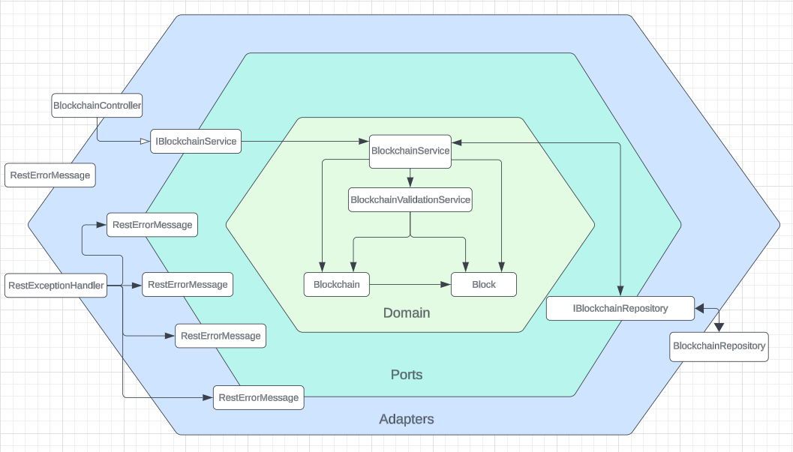

# SpringChainAPI

Blockchain Ecosystem simulator API in SpringBoot project

[![Contributors][contributors-shield]][contributors-url]
[![Forks][forks-shield]][forks-url]
[![Stargazers][stars-shield]][stars-url]
[![Issues][issues-shield]][issues-url]
[![MIT License][license-shield]][license-url]
[![LinkedIn][linkedin-shield]][linkedin-url]

[](https://github.com/RichardLitt/standard-readme)


This project is a blockchain ecosystem simulator, with main functionalities for creating, validating, and storing blocks in a chain following blockchain standards. Developed in Java, using the Spring framework and the H2 in-memory database. The goal of this API is to provide an initial impression of the Blockchain environment, providing functions for data storage in blocks.

## Table of Contents
1. [Architecture](#architecture)
1. [Installation](#installation)
2. [Usage](#usage)
3. [Endpoints](#endpoints)
4. [Contributing](#contributing)
5. [License](#license)
6. [Creators](#creators-)
7. [Contributors](#contributors)

### Built With

[![Spring][Spring]][Spring-url]

## Architecture

The API was developed using the Hexagonal Architecture, also known as Ports and Adapters Architecture. This approach 
was chosen to promote a clear separation between business logic and infrastructure concerns, thereby increasing flexibility, testability, and code maintainability.



## Installation

Step-by-step to install:
1. Download and install [Java 17](https://www.oracle.com/br/java/technologies/downloads/#java17)
2. Download and install [Java8 SE](https://www.oracle.com/br/java/technologies/javase/javase8-archive-downloads.html).
3. Download and install [IntelliJ](https://www.jetbrains.com/pt-br/idea/download/?section=windows) IDEA, or any other Java IDE of your preference.
4. Clone this repository.
5. Open the project in the IDE and run the `ApiApplication` script.

## Usage

To start the application:
1. Configure the necessary environment variables.
2. Run the command `mvn spring-boot:run` in the project's root directory.
3. The API will be available at `http://localhost:8080`.

## Endpoints

### Endpoints List
- **Initialization Blockchain :** `/api/blockchain/init`
- **Add Block :** `/api/blockchain/block`
- **Get Latest Block :** `/api/blockchain/block/latest`
- **Get Blocks by Blockchain :** `Get Blocks by Blockchain`
- **Find Block by Hash :** `/api/blockchain/block/find`
- **Find Blocks by Topic :** `/api/blockchain/block/find/topic`
- **Find Latest Block by Topic :** `/api/blockchain/block/latest/find/topic`
- **Load Persisted Blockchains :** `/api/blockchain/block/persistence/load`

### Initialization Blockchain
- **URL:** `/api/blockchain/init`
- **Method:** `POST`
- **Description:** Inicializa uma nova blockchain com a dificuldade especificada.
- **Parameters:** `difficulty` (int)
- **Request Sample:** `POST /api/blockchain/init?difficulty=2`
- **Response Sample:**
  ```json
  {
    "id": 1,
    "blocks": [
        {
            "index": 0,
            "timestamp": 1716754856915,
            "hash": "000f289b41024e6aee72eee4a7a9d30342205dad69cda824d7376af88a457743",
            "previousHash": null,
            "data": "Block Gênesis"
        }
    ],
    "difficulty": 3
  }

### Add Block
- **URL:** `/api/blockchain/block`
- **Method:** `POST`
- **Description:** Adds a new block to the specified blockchain.
- **Parameters:**
  ```json
  {
    "blockchainID": 1,
    "blockData": {
        "username": "Teste",
        "email": "VejoLucasTeste@gmail.com",
        "senha": "5678",
        "status": 0,
        "permisssao": "USER"
    }
  }
- **Request Sample:** `POST /api/blockchain/block`
- **Response sample:**
  ````json
  {
    "index": 1,
    "timestamp": 1716754912521,
    "hash": "0000d52decd47df19f57376a34fa23493b07c9accd8583f763aefc8d966b600b",
    "previousHash": "000ebd1c608c1483aefdb3f32766124dd71546b777b1881c02daf3731bc5b17d",
    "data": "{\"username\":\"Teste\",\"email\":\"VejoLucasTeste@gmail.com\",\"senha\":\"5678\",\"status\":0,\"permisssao\":\"USER\"}"
  }
  
### Get Latest Block
- **URL:** `/api/blockchain/block/latest`
- **Method:** `GET`
- **Description:** Returns the latest block added to the specified blockchain.
- **Parameters:** `idBlockchain` (long)
- **Example Request** `GET /api/blockchain/block/latest?idBlockchain=1`
- **Example Response**
  ````json
  {
    "index": 1,
    "timestamp": 1716755009782,
    "hash": "00002c7b0fc38a1f636276bc5218dd00b953029da01a05e2d3af8a5232eb604a",
    "previousHash": "00084a2f010de6f0f37504e73bf2cbeb3e9ca038a02f21cbe1f99f7026312fc8",
    "data": "{\"username\":\"Teste\",\"email\":\"VejoLucasTeste@gmail.com\",\"senha\":\"5678\",\"status\":0,\"permisssao\":\"USER\"}"
  }
  
### Get Blocks by Blockchain
- **URL:** `/api/blockchain/blocks`
- **Method:** `GET`
- **Description:** Returns all blocks from the specified blockchain.
- **Parameters:** `idBlockchain` (long)
- **Example Request** `GET /api/blockchain/blocks?idBlockchain=1`
- **Example Response**
  ````json
  [
    {
        "index": 0,
        "timestamp": 1716755108322,
        "hash": "00066c74d6b1d19ec1f3083ebd4a1ad91061adce408d87f8741ad793aa166cd5",
        "previousHash": null,
        "data": "Block Gênesis"
    },
    {
        "index": 1,
        "timestamp": 1716755110536,
        "hash": "000c3d0db0b0b567f76c0ff44042dcff3923eef2185bbf4f1aef46fd5ee56a61",
        "previousHash": "00066c74d6b1d19ec1f3083ebd4a1ad91061adce408d87f8741ad793aa166cd5",
        "data": "{\"username\":\"Teste\",\"email\":\"VejoLucasTeste@gmail.com\",\"senha\":\"5678\",\"status\":0,\"permisssao\":\"USER\"}"
    }
  ]

### Find Block by Hash
- **URL:** `/api/blockchain/block/find`
- **Method:** `GET`
- **Description:** Finds a block in the specified blockchain by its hash.
- **Parameters:**
  ````json
  {
    "blockchainID": 1,
    "blockHash": "000cf935a1f7ab5a427651883b16c34dc96573c751f0e4bf39c69098a1b30435"
  }
- **Example Request** `GET /api/blockchain/block/find`
- **Example Response**
  ````json
  {
    "index": 1,
    "timestamp": 1716755044840,
    "hash": "000cf935a1f7ab5a427651883b16c34dc96573c751f0e4bf39c69098a1b30435",
    "previousHash": "000c4dbe3f691c7a97cb80dc81040d1f004c1607ac0813021e74978f1b9cdffb",
    "data": "{\"username\":\"Teste\",\"email\":\"VejoLucasTeste@gmail.com\",\"senha\":\"5678\",\"status\":0,\"permisssao\":\"USER\"}"
  }

### Find Blocks by Topic
- **URL:** `/api/blockchain/blocks/find/topic`
- **Method:** `GET`
- **Description:** Finds blocks in the specified blockchain by a specific field and value.
- **Parameters:**
  ````json
  {
    "fieldName": "username",
    "value": "Teste",
    "idBlockchain": 1
  }
- **Example Request** `GET /api/blockchain/block/find/topic`
- **Example Response**
  ````json
  [
    {
        "index": 1,
        "timestamp": 1716755173825,
        "hash": "00087b41612722e8700e9a655ce79c20c43ab8e1ef71575a1f363d3198422ac3",
        "previousHash": "0001ad5797f75001d6000139d6747e54ed0abf9e48d33dd8e3cf8d2d3a8a385a",
        "data": "{\"username\":\"Teste\",\"email\":\"VejoLucasTeste@gmail.com\",\"senha\":\"5678\",\"status\":0,\"permisssao\":\"USER\"}"
    }
  ]

### Find Latest Block by Topic
- **URL:** `/api/blockchain/block/latest/find/topic`
- **Method:** `GET`
- **Description:** Finds blocks in the specified blockchain by a specific field and value.
- **Parameters:**
  ````json
  {
    "fieldName": "username",
    "value": "Teste",
    "idBlockchain": 1
  }
- **Example Request** `GET /api/blockchain/block/latest/find/topic`
- **Example Response**
  ````json
  {
    "index": 1,
    "timestamp": 1716755407494,
    "hash": "000bd553a9b31ad6789a8f8209e05a284b06ab69d9ec8f65c218c14cf950c6ac",
    "previousHash": "000ccb046dcb4fe88256d0f187982e426e9eb2a902d12d6211c1124938da8901",
    "data": "{\"username\":\"Teste\",\"email\":\"VejoLucasTeste@gmail.com\",\"senha\":\"5678\",\"status\":0,\"permisssao\":\"USER\"}"
  }
  
### Load Persisted Blockchains
- **URL:** `/api/blockchain/block/persistence/load`
- **Method:** `GET`
- **Description:** Loads all persisted blockchains from JSON files to JPA.
- **Example Request** `GET /api/blockchain/block/persistence/load`
- **Example Response**
  ````json
  [
    {
        "id": 1,
        "blocks": [
            {
                "index": 0,
                "timestamp": 1716755400821,
                "hash": "000ccb046dcb4fe88256d0f187982e426e9eb2a902d12d6211c1124938da8901",
                "previousHash": null,
                "data": "Block Gênesis"
            },
            {
                "index": 1,
                "timestamp": 1716755407494,
                "hash": "000bd553a9b31ad6789a8f8209e05a284b06ab69d9ec8f65c218c14cf950c6ac",
                "previousHash": "000ccb046dcb4fe88256d0f187982e426e9eb2a902d12d6211c1124938da8901",
                "data": "{\"username\":\"Teste\",\"email\":\"VejoLucasTeste@gmail.com\",\"senha\":\"5678\",\"status\":0,\"permisssao\":\"USER\"}"
            }
        ],
        "difficulty": 3
    },
    {
        "id": 2,
        "blocks": [
            {
                "index": 0,
                "timestamp": 1716755477297,
                "hash": "000ce2b5c8c15568ddab275973d171e02fe675e298777a59e8c462d8b60ab9d6",
                "previousHash": null,
                "data": "Block Gênesis"
            }
        ],
        "difficulty": 3
    },
    {
        "id": 3,
        "blocks": [
            {
                "index": 0,
                "timestamp": 1716755478008,
                "hash": "00079defa2ecec8f4cd24e1f0bfd8f4f35b666e90a9bb39ce46ead12ca674122",
                "previousHash": null,
                "data": "Block Gênesis"
            }
        ],
        "difficulty": 3
    },
    {
        "id": 4,
        "blocks": [
            {
                "index": 0,
                "timestamp": 1716755478610,
                "hash": "000e305db10b9dfe1481d7d568b507b6554af8fa322c49e3f99e5805961646d0",
                "previousHash": null,
                "data": "Block Gênesis"
            }
        ],
        "difficulty": 3
    },
    {
        "id": 5,
        "blocks": [
            {
                "index": 0,
                "timestamp": 1716755479031,
                "hash": "0000468e8c9aaa551977e71097298c285d5d717639f812c8b61c95e99b9364ff",
                "previousHash": null,
                "data": "Block Gênesis"
            }
        ],
        "difficulty": 3
    }
  ]

### Contributing

Contributions are what make the open source community such an amazing place to learn, inspire, and create. Any contributions you make are **greatly appreciated**.

If you have a suggestion that would make this better, please fork the repo and create a pull request. You can also simply open an issue with the tag "enhancement".
Don't forget to give the project a star! Thanks again!

1. Fork the Project
2. Create your Feature Branch (`git checkout -b feature/AmazingFeature`)
3. Commit your Changes (`git commit -m 'Add some AmazingFeature'`)
4. Push to the Branch (`git push origin feature/AmazingFeature`)
5. Open a Pull Request

<p align="right">(<a href="#readme-top">back to top</a>)</p>

## License

Distributed under the MIT License. See `LICENSE.txt` for more information.

<p align="right">(<a href="#readme-top">back to top</a>)</p>


## Creators [🔝](#SpringChainAPI)

|                                                                                                                                              Author                                                                                                                                              |                                                                   Collaborator                                                                   |
|:------------------------------------------------------------------------------------------------------------------------------------------------------------------------------------------------------------------------------------------------------------------------------------------------:|:------------------------------------------------------------------------------------------------------------------------------------------------:|
|                                                                                  [<br><sub>@JulioCFSdev</sub>](https://github.com/JulioCFSdev)                                                                                  |                  [<br><sub>@olucascruz</sub>](https://github.com/olucascruz)                   |

## Contributors

 <a href = "https://github.com/JulioCFSdev/SpringChainAPI/graphs/contributors">
   
 </a>

[contributors-shield]: https://img.shields.io/github/contributors/JulioCFSdev/SpringChainAPI.svg?style=for-the-badge
[contributors-url]: https://github.com/JulioCFSdev/SpringChainAPI/graphs/contributors
[forks-shield]: https://img.shields.io/github/forks/JulioCFSdev/SpringChainAPI.svg?style=for-the-badge
[forks-url]: https://github.com/JulioCFSdev/SpringChainAPI/network/members
[stars-shield]: https://img.shields.io/github/stars/JulioCFSdev/SpringChainAPI.svg?style=for-the-badge
[stars-url]: https://github.com/JulioCFSdev/SpringChainAPI/stargazers
[issues-shield]: https://img.shields.io/github/issues/JulioCFSdev/SpringChainAPI.svg?style=for-the-badge
[issues-url]: https://github.com/JulioCFSdev/SpringChainAPI/issues
[license-shield]: https://img.shields.io/github/license/JulioCFSdev/SpringChainAPI.svg?style=for-the-badge
[license-url]: https://github.com/JulioCFSdev/SpringChainAPI/blob/master/LICENSE.txt
[linkedin-shield]: https://img.shields.io/badge/-LinkedIn-black.svg?style=for-the-badge&logo=linkedin&colorB=555
[linkedin-url]: https://www.linkedin.com/in/juliocesarferreiradesouza/
[Spring]: https://img.shields.io/badge/Spring-6DB33F?style=for-the-badge&logo=spring&logoColor=white
[Spring-url]: https://spring.io
[SpringBoot]: https://img.shields.io/badge/Spring-6DB33F?style=for-the-badge&logo=spring&logoColor=white
[SpringBoot-url]: https://spring.io